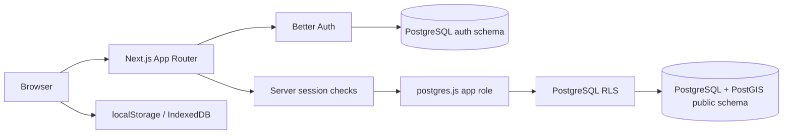

# GOSHEN OS Architecture

## Product boundary

GOSHEN OS is intended to be one multi-tenant application serving multiple organizations, farms, and users. A farm is a row in the shared database, not a code branch or deployment. Organization membership grants access to an organization; farm membership can further restrict access to assigned farms.

The repository currently has two experiences that must be reconciled:

1. `/` is an anonymous local workspace. Its records live in browser `localStorage` and its backup is downloaded by the user.
2. `/dashboard` and domain routes are a server/database-backed application using Better Auth sessions and PostgreSQL.

The local workspace is useful for a no-account trial, but it is not cloud persistence, team sharing, or the same record set as the authenticated app. Keep that distinction visible until a deliberate account migration/import workflow exists.

## Current request path



The diagram shows current code boundaries, not proof of production deployment configuration. Auth uses the owner database connection in server code; domain operations use `DATABASE_URL_APP` and `withUser()` to set transaction-local `app.user_id`. Production refuses to start the app DB client without `DATABASE_URL_APP`; development can warn and fall back to the owner URL.

## Recommended feature boundaries

- **Presentation:** `app/`, `components/`; route screens and reusable UI only.
- **Authentication and authorization:** `lib/auth/`, server session helpers, and route/server-action guards.
- **Database access:** `lib/db/`, database-facing services, migrations under `db/migrations/`.
- **Domain behavior:** focused feature modules for farms, GIS, crops, livestock, inventory, finance, analytics, and reports. Move rules out of large UI components and server actions incrementally.
- **Offline:** `lib/offline/` owns local queue/cache behavior. A queued operation must identify its organization/farm, be authorized again on the server, and handle conflicts/retries.
- **External providers:** provider interfaces (weather, maps/terrain) must report whether data is live, unavailable, or mock.

## Authentication and first-use flow

1. User signs up or signs in through Better Auth email/password.
2. Better Auth persists identity/session in schema `auth` using the Postgres.js Kysely dialect and explicit mappings to the existing snake_case columns.
3. A server handler reads and validates the Better Auth session.
4. An authenticated user creates an organization and first farm through onboarding; neither is hardcoded.
5. Each domain operation runs with the user ID set inside its database transaction. RLS enforces tenant policy even if a client sends another tenant's ID.

Email verification is currently disabled, so successful signup should start an authenticated session and proceed to the dashboard. Password recovery and verified-email policy still need an explicit product decision before launch.

## Tenant security model

Canonical relationship:

```text
auth.user
  └─ profiles
      ├─ organization_members ─ organizations
      │                         └─ farms
      │                             └─ farm_members
      └─ invitations
```

Tenant-owned rows should carry `organization_id`, `farm_id`, or both as appropriate. RLS predicates should derive access from active membership and role, not trust user-supplied IDs. Global reference tables may allow read-only access. Security-definer functions require narrowly scoped grants and must be reviewed for search path and caller authorization.

Roles presently include owner, admin, manager, accountant, agronomist, veterinarian, inventory manager, worker, and viewer. The `roles`/`role_permissions` tables provide a place for finer permissions, but database enforcement for every distinction must be verified before claiming role-based controls are complete.

## GIS and offline boundaries

- PostGIS stores farm/plot geometry in SRID 4326 and computes area/perimeter where migrations define generated or validated values.
- Phone GPS capture must retain raw points/accuracy and validate geometry before save; a visual path alone is not a persisted farm boundary.
- MapLibre and Leaflet are both present. Standardize on one primary interactive map after route-by-route review; keep a justified second renderer only if a concrete feature requires it.
- IndexedDB and service-worker caching are not a sync system by themselves. Every queued operation needs a corresponding authenticated endpoint, tenant scope, idempotency key, retry state, and conflict policy.
- Never cache private tenant data without session/tenant isolation and sign-out/account-switch cleanup.

## Deployment and secrets

Required/optional variable names in source are listed in [AUDIT_REPORT.md](./AUDIT_REPORT.md). Secrets belong only in local ignored env files or deployment secret settings. `.env.production` is not tracked. Deploy migrations through the migration process, inspect the exact SQL and side effects first, and verify the recorded migration state. The current `db:migrate` script also provisions/rotates the app DB role and writes `.env.local`; do not treat it as a schema-only command.

## Known gaps

- Signup adapter/schema fix is local and needs the auth migration plus a real account/session verification in the target deployment.
- Local workspace and authenticated workspace do not yet share data.
- Unit test runner is not installed; RLS verification and full workflows have not been run in this audit.
- Offline sync references routes that are not present in the inspected App Router.
- Mock weather and unavailable Cesium fallback need clear product status.
- Full multi-tenant, GIS, finance, inventory, crop, livestock, and mobile workflows remain unverified.

See [DATABASE.md](./DATABASE.md), [SECURITY.md](./SECURITY.md), [IMPLEMENTATION_ROADMAP.md](./IMPLEMENTATION_ROADMAP.md), and [AUDIT_REPORT.md](./AUDIT_REPORT.md).
