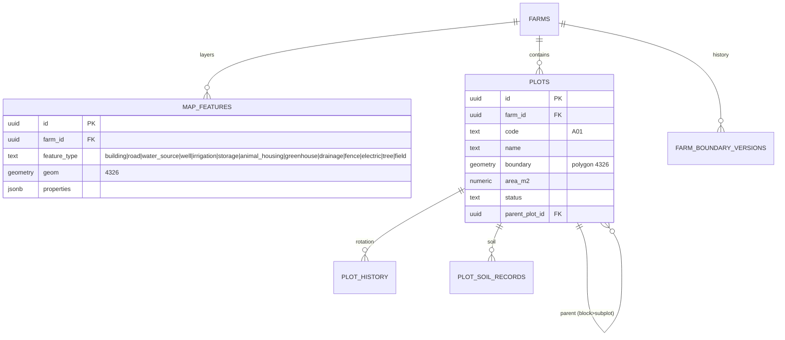
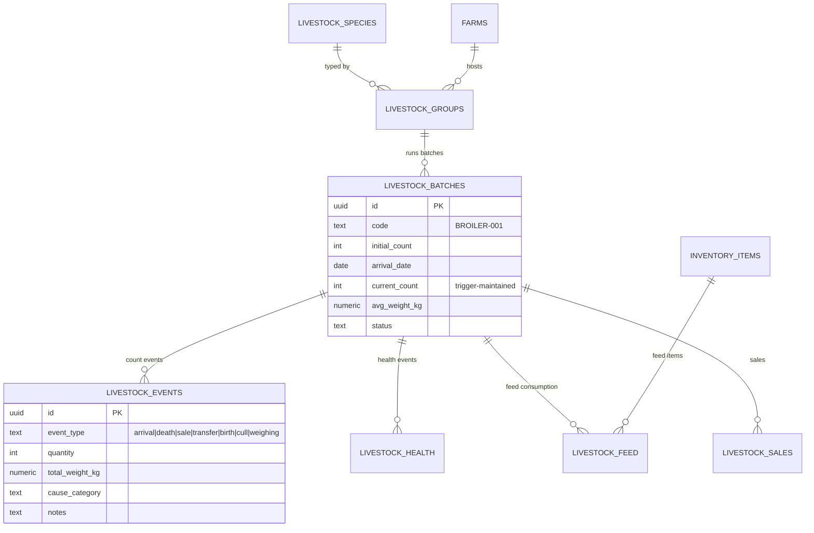
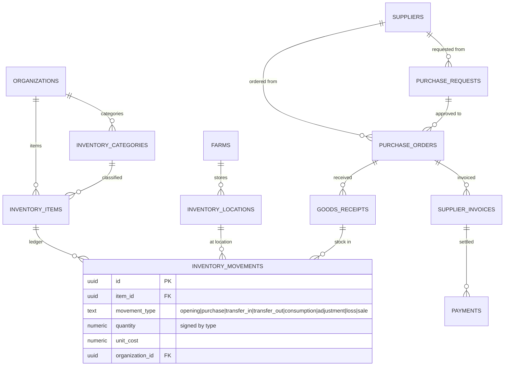
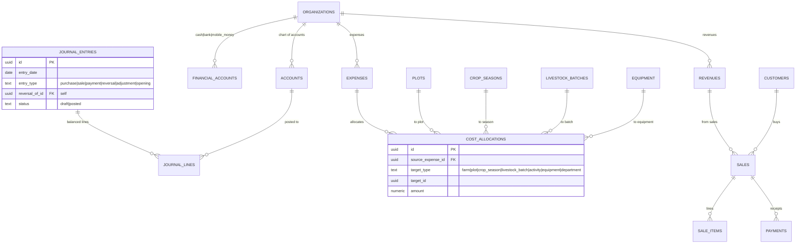
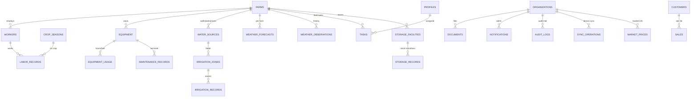

# 02 — Database ERD

PostgreSQL 15 + PostGIS 3.4 + pgvector. All tenant tables carry
`organization_id`; farm-scoped tables also carry `farm_id`. UUID v7-style PKs
(time-ordered, index-friendly). This ERD shows core relationships; the complete
column-level definition is in `03-database-schema.md`.

## 1. Tenancy & Identity

```mermaid
erDiagram
    AUTH_USERS ||--|| PROFILES : "1:1"
    PROFILES ||--o{ ORGANIZATION_MEMBERS : "joins"
    ORGANIZATIONS ||--o{ ORGANIZATION_MEMBERS : "has"
    ORGANIZATIONS ||--o{ FARMS : "owns"
    FARMS ||--o{ FARM_MEMBERS : "scopes"
    PROFILES ||--o{ FARM_MEMBERS : "joins"
    ORGANIZATIONS ||--|| SUBSCRIPTIONS : "subscribes"
    PLANS ||--o{ SUBSCRIPTIONS : "plan"
    ORGANIZATIONS ||--o{ USAGE_RECORDS : "usage"

    ORGANIZATIONS {
        uuid id PK
        text name
        text slug UK
        char3 default_currency
        text country
        text status
    }
    FARMS {
        uuid id PK
        uuid organization_id FK
        text name
        text farm_type
        text ownership_type
        text country, region, district, ward, village
        geometry boundary "polygon 4326"
        numeric area_m2 "ST_Area(geography)"
        geography centroid
    }
```

## 2. GIS / Land



## 3. Crops (operations → finance)

```mermaid
erDiagram
    ORGANIZATIONS ||--o{ CROPS : "catalog"
    CROPS ||--o{ CROP_VARIETIES : "varieties"
    FARMS ||--o{ SEASONS : "has"
    PLOTS ||--o{ CROP_SEASONS : "planted"
    CROPS ||--o{ CROP_SEASONS : "what"
    CROP_VARIETIES ||--o{ CROP_SEASONS : "variety"
    CROP_SEASONS ||--o{ CROP_ACTIVITIES : "activities"
    CROP_ACTIVITIES ||--o{ CROP_INPUTS : "materials used"
    INVENTORY_ITEMS ||--o{ CROP_INPUTS : "from stock"
    CROP_SEASONS ||--o{ HARVESTS : "yields"
    CROP_SEASONS ||--o{ COST_ALLOCATIONS : "costs"
    WORKERS ||--o{ CROP_ACTIVITIES : "performed by"

    CROP_SEASONS {
        uuid id PK
        uuid plot_id FK
        uuid crop_id FK
        uuid season_id FK
        date planting_date
        date expected_harvest_date
        numeric target_yield_kg
        numeric seed_quantity, seed_cost
        text status
    }
    CROP_ACTIVITIES {
        uuid id PK
        uuid crop_season_id FK
        text activity_type "land_prep|ploughing|planting|fertilization|weeding|spraying|irrigation|pest_control|disease_observation|pruning|harvest"
        date activity_date
        uuid worker_id FK
        numeric cost
        geography location
        jsonb attachments
        text notes
    }
```

## 4. Livestock



## 5. Inventory & Procurement



## 6. Finance & Accounting



## 7. Operations Support (labor, equipment, irrigation, weather, tasks…)



## 8. AI / Knowledge (RAG)

```mermaid
erDiagram
    KNOWLEDGE_SOURCES ||--o{ KNOWLEDGE_DOCUMENTS : "publishes"
    KNOWLEDGE_DOCUMENTS ||--o{ KNOWLEDGE_CHUNKS : "chunked + embedded"
    PROFILES ||--o{ AI_QUERIES : "asks"
    AI_QUERIES ||--|| AI_RESPONSES : "answered by"
    AI_RESPONSES ||--o{ AI_CITATIONS : "cites"
    AI_RESPONSES ||--o{ KNOWLEDGE_CHUNKS : "retrieved evidence"
    AI_CITATIONS ||--o{ AUDIT-able farm entities : "farm-data evidence refs"
```

## 9. Full Table Inventory

Identity: `profiles, organizations, organization_members, farm_members, invitations, platform_admins, roles, role_permissions`
Farms/GIS: `farms, farm_boundaries_versions, farm_settings, plots, plot_history, plot_soil_records, map_features`
Crops: `seasons, crops, crop_varieties, crop_seasons, crop_activities, crop_inputs, harvests`
Livestock: `livestock_species, livestock_groups, livestock_batches, livestock_events, livestock_health, livestock_feed, livestock_sales`
Inventory/Procurement: `inventory_categories, inventory_items, inventory_locations, inventory_movements, suppliers, purchase_requests, purchase_order_items, purchase_orders, goods_receipt_items, goods_receipts, supplier_invoices`
Finance: `accounts, financial_accounts, journal_entries, journal_lines, payments, expenses, revenues, cost_allocations`
Ops: `workers, labor_records, equipment, equipment_usage, maintenance_records, water_sources, irrigation_zones, irrigation_records, soil_records (plot_soil_records), storage_facilities, storage_records`
Market/Sales: `customers, sales, sale_items, market_prices`
Platform/Field: `documents, tasks, task_updates, notifications, notification_preferences, audit_logs, sync_operations`
Weather/External: `weather_observations, weather_forecasts, weather_alerts, satellite_scenes (pending), provider_sync_state`
AI: `knowledge_sources, knowledge_documents, knowledge_chunks, ai_queries, ai_responses, ai_citations`
SaaS: `plans, subscriptions, usage_records`
